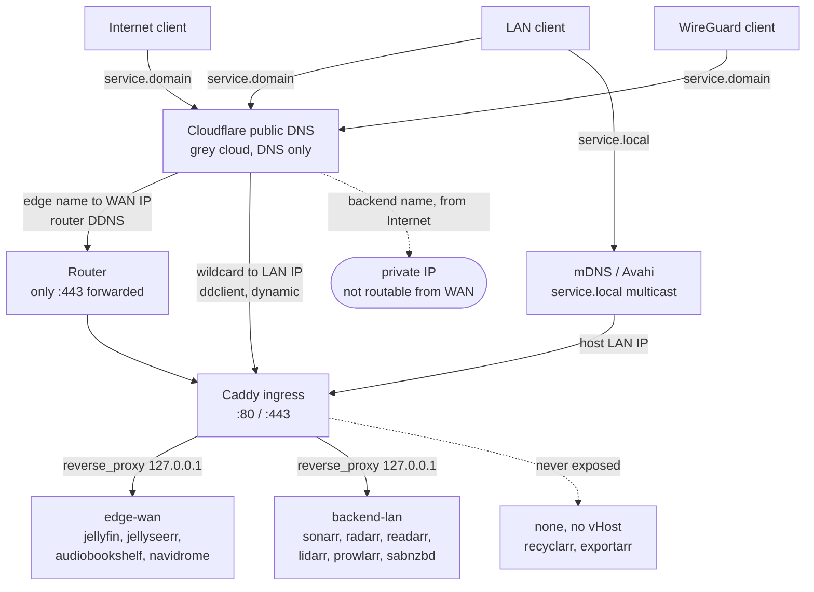
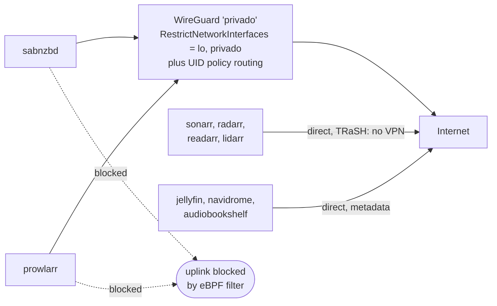
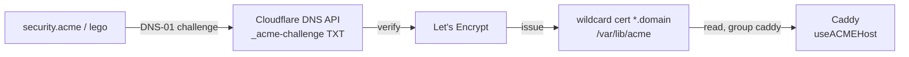

# Network topology — who reaches what, and from where

Overview of the reachability model: LAN, WAN, WireGuard, mDNS/`.local`,
Cloudflare and Let's Encrypt. Written in English so it is usable for outside
collaborators.

**Core principle:** every service binds to `127.0.0.1` only. Nothing is reachable
without passing through the Caddy ingress — `.local` included. A direct
`192.168.x.y:5003` never works.

---

## 1. Reachability matrix

| From | `{service}.{domain}` — **edge-wan** | `{service}.{domain}` — **backend-lan** | `{service}.local` |
|------|--------------------------------------|-----------------------------------------|-------------------|
| **Internet (WAN)** | ✅ via router `:443` → Caddy | ❌ resolves to a private IP → not routable | ❌ multicast never leaves the LAN |
| **LAN** | ✅ | ✅ | ✅ |
| **WireGuard client** | ✅ | ✅ (routed at L3) | ❌ mDNS is L2 multicast, does not traverse WireGuard |
| **Valid TLS certificate** | ✅ wildcard from Let's Encrypt | ✅ same wildcard | ❌ no public CA → HTTP or `tls internal` |
| **Passkeys / WebAuthn** | ✅ | ✅ | ❌ no Secure Context without valid HTTPS |

`.local` is a convenience path for the LAN. Anything that needs passkey login must
use `{service}.{domain}`.

---

## 2. Inbound — name resolution and entry

**Key points**

- Only **two** DNS anchors are maintained dynamically: the edge names follow the
  **WAN IP** (router DDNS), the wildcard `*` plus `@` follow the **current LAN IP**
  (`ddclient` using `ip route get 1.1.1.1`, so any subnet works: 192.168, 172.16, 10.0).
- Backend names deliberately resolve to a **private IP**. From the Internet the
  connection dies at routing — that is the intended protection.
- Edge names stay **unproxied / grey cloud** (streaming ToS).

---

## 3. Outbound — egress and VPN confinement

**Key points**

- The downloaders can physically only open sockets on `lo` and the VPN interface.
  Even if the VPN routing table disappears, they cannot fall back to the uplink —
  that is the kill switch.
- The `*arr` services intentionally run **without** VPN: metadata providers block
  known VPN ranges (TRaSH guidelines).
- DNS for the confined services is pinned via a bind-mounted `resolv.conf`.

---

## 4. TLS — certificates without opening a port

**Key points**

- **DNS-01** proves domain ownership through a TXT record, so the host never has to
  be publicly reachable. This is why LAN-only services still get a valid certificate.
- One wildcard `*.{domain}` covers every service. The apex `{domain}` needs to be
  listed separately — a wildcard does not cover it.
- Certificates are issued by lego, not by Caddy (separation of concerns).

---

## 5. Common traps

| Trap | Why it hurts |
|------|--------------|
| `.local` in Cloudflare | `.local` is multicast-only; a unicast record collides with mDNS |
| Expecting `.local` to work over WireGuard | multicast is L2, WireGuard is L3 |
| Passkey login on `.local` | no valid certificate → no Secure Context → WebAuthn refuses |
| Orange cloud on streaming edge | Cloudflare ToS, and it breaks streaming |
| Hardcoding a LAN IP or NIC name | breaks on a new router, subnet or machine |
| Opening service ports in the firewall | bypasses Caddy and its auth entirely |
